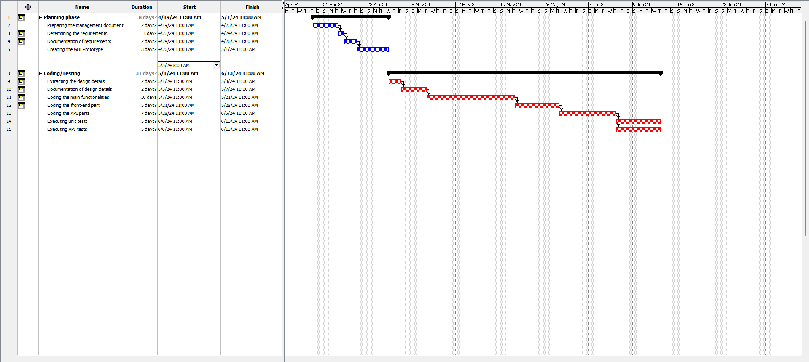

# Project Estimation - CURRENT
Date:05/05/2024

Version:1

# Estimation approach
Consider the EZElectronics  project in CURRENT version (as given by the teachers), assume that you are going to develop the project INDEPENDENT of the deadlines of the course, and from scratch
# Estimate by size

We used delphi technique
### 
|             | Estimate                        |             
| ----------- | ------------------------------- |  
| NC =  Estimated number of classes to be developed   | 8   |             
|  A = Estimated average size per class, in LOC       |    200     | 
| S = Estimated size of project, in LOC (= NC * A) | 1600 |
| E = Estimated effort, in person hours (here use productivity 10 LOC per person hour)  |       160                    |   
| C = Estimated cost, in euro (here use 1 person hour cost = 30 euro) | 4800 | 
| Estimated calendar time, in calendar weeks (Assume team of 4 people, 8 hours per day, 5 days per week ) |        1       |               

# Estimate by product decomposition
### 
|         component name    | Estimated effort (person hours)   |             
| ----------- | ------------------------------- | 
| requirement document | 16 |
| GUI prototype | 12 |
| design document |16|
| code | 100 |
| unit tests | 48 |
| api tests | 24 |
| management documents  | 16 |

# Estimate by activity decomposition
### 
|         Activity name    | Estimated effort (person hours)   |             
| ----------- | ------------------------------- | 
|Preparing the management document| 16 |
|Determining the requirements| 8 |
|Documentation of requirements | 8 |
|Creating the GUI Prototype | 12 |
|Extracting the design details| 8 |
|Documentation of design details| 8 |
|Coding the main functionalities| 40 |
|Coding the front-end part|24|
|Coding the API parts| 36 |
|Executing unit tests| 48 |
|Executing API tests| 24 |
###
Insert here Gantt chart with above activities

# Summary

Report here the results of the three estimation approaches. The  estimates may differ. Discuss here the possible reasons for the difference

|             | Estimated effort                        |   Estimated duration |          
| ----------- | ------------------------------- | ---------------|
| estimate by size |160| 1 calendar week|
| estimate by product decomposition |232| 39 calendar days |
| estimate by activity decomposition |232 person hours| 39 calendar days |

Estimated duration in decompositions are calculated according to a time spent from daily university students instead of full-time job working hours. So if we assume 4 people are working together in 8 hours a day schedule the duration would be 7.25 days.